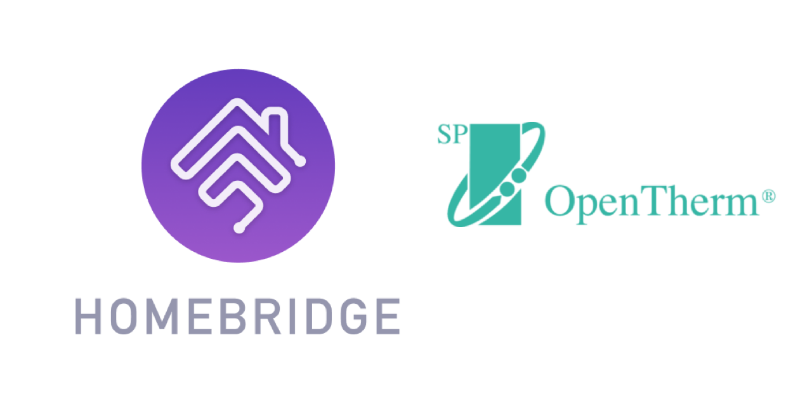

<p align="center">
    
</p>
<span align="center">

# Homebridge OTGW
[](https://www.npmjs.com/package/homebridge-otgw)
[](https://www.npmjs.com/package/homebridge-otgw)
[](https://discord.gg/hZubhrz)

[](https://github.com/ebaauw/homebridge-otgw/issues)
[](https://github.com/ebaauw/homebridge-otgw/pulls)
[](https://standardjs.com)

</span>

## Homebridge plugin for OpenTherm Gateway
Copyright © 2019-2020 Erik Baauw. All rights reserved.

This [Homebridge](https://github.com/homebridge/homebridge) plugin exposes an [OpenTherm Gateway](http://www.otgw.tclcode.com/index.html) (OTGW) to Apple's [HomeKit](http://www.apple.com/ios/home/).

### Work in Progress
Currently, Homebridge OTGW exposes three _Thermostat_ accessories: **Thermostat**, **Boiler**, and **HotWater**, as described below, each with its own Eve history.

#### 1. Room Thermostat
An accessory with a _Thermostat_ service to expose the room thermostat:

Characteristic | OpenTherm | ID
-- | -- | --
_Current Heating Cooling State_ | Central Heating Mode (in Status) | 0
_Target Heating Cooling State_ | Remote Override Room Setpoint| 9
_Current Temperature_ | Room Temperature | 24
_Target Temperature_ | Room Setpoint<br>Remote Override Room Setpoint | 16<br>9
_Valve Position_ | Max Relative Modulation Level<br> | 14

The _Target Heating Cooling State_ reflects who set the Room Setpoint: the thermostat schedule (_Auto_) or the user (_Heat_).

#### 2. Boiler - Central Heating
An accessory with a _Thermostat_ service to expose the boiler's Central Heating (CH) function:

Characteristic | OpenTherm | ID
-- | -- | --
_Current Heating Cooling State_ | Flame Status (in Status) | 0
_Target Heating Cooling State_ (read only) | Central Heating Enable (in Status) | 0
_Current Temperature_ | Boiler Water Temperature | 25
_Target Temperature_ (read-only)| Control Setpoint | 1
_Valve Position_ | Relative Modulation Level | 17

The _Target Temperature_ and _Target Heating Cooling State_ are controlled by the modulating Thermostat, so updates by the user are ignored.

Todo: Expose Return Water Temperature (28) as additional _Temperature Sensor_ service (without history) in this accessory, or as a separate accessory (with history).

#### 3. Boiler - Domestic Hot Water
An accessory with a _Thermostat_ service to expose the boiler's Domestic Hot Water (DHW) function:

Characteristic | OpenTherm | ID
-- | -- | --
_Current Heating Cooling State_ | DHW Mode (in Status) | 0
_Target Heating Cooling State_ | DHW Enable (in Status) | 0
_Current Temperature_ | DHW Temperature<br>Boiler Water Temperature | 26<br>25
_Target Temperature_ | DHW Setpoint | 56
_Valve Position_ | DHW Mode (in Status) | 0

My boiler doesn't support DHW Temperature, so use Boiler Water Temperature instead.

The _Target Heating Cooling State_ should reflects sets the DHW mode: _Auto_ for thermostat controlled, _Heat_ for Confort Mode, and _Off_ for Eco mode.  My boiler allows these settings, and my thermostat can turn DHW Mode off automatically during the night and/or on holidays.

#### 4. Outside Temperature
TODO - Currently not exposed: an accessory with a _Temperature Sensor_ service to expose the outside temperature.

Characteristic | OpenTherm | ID
-- | -- | --
_Current Temperature_ | Outside Temperature | 27

My boiler has no outside temperature sensor, but I'm feeding the outside temperature from OpenWeatherMap to the OTGW gateway.  Currently I'm doing this by running a small `bash` script, [`weather.sh`](https://github.com/ebaauw/Homebridge OTGW/blob/master/cli/weather.sh), every 15 minutes from `cron`. It would be nicer instead to link to a _Temperature Sensor_ exposed by another Homebridge plugin (like [homebridge-ws](https://github.com/ebaauw/homebridge-ws)), but that needs [Homebridge v0.5](https://github.com/homebridge/homebridge/issues/1039).

Ideally I would like to enable CH Comfort mode (or fireplace mode) from here (control the boiler based on the Outside Temperature instead of on the Room Temperature), but this seems to be a local setting on the thermostat, not exposed over OpenTherm.

### Prerequisites
You need an [OpenTherm Gateway](http://otgw.tclcode.com) with firmware [4.2.5](http://otgw.tclcode.com/download.html), wired to an OpenTherm [compatible](http://otgw.tclcode.com/matrix.cgi) boiler and room thermostat.
I have a Remeha Avanta and a Honeywell Chromotherm Vision Modulation.
Please check that your setup works using [OpenTherm Monitor](http://www.otgw.tclcode.com/otmonitor.html) (OTM), before trying Homebridge OTGW.
I'm running OTM in a Raspberry Pi, as there's no pre-compiled macOS version.

I bought my OTGW pre-soldered from [Nodo Shop](https://www.nodo-shop.nl/en/opentherm-gateway/188-opentherm-gateway.html), with an optional NodeMCU to connect the OTGW to my WiFi network.
See the [Assembly Instructions](https://www.nodo-shop.nl/nl/index.php?controller=attachment&id_attachment=47) (in Dutch, unfortunately) how to wire the OTGW to the thermostat and boiler and how to configure the NodeMCU as serial server.

You need a server to run Homebridge.
This can be anything running [Node.js](https://nodejs.org): from a Raspberry Pi, a NAS system, or an always-on PC running Linux, macOS, or Windows.
See the [Homebridge Wiki](https://github.com/homebridge/homebridge/wiki) for details.
I run Homebridge ZP on a Raspberry Pi 3B+.

To interact with HomeKit, you need Siri or a HomeKit app on an iPhone, Apple Watch, iPad, iPod Touch, or Apple TV (4th generation or later).
I recommend to use the latest released versions of iOS, watchOS, and tvOS.  
Please note that Siri and even Apple's [Home](https://support.apple.com/en-us/HT204893) app still provide only limited HomeKit support.
To use the full features of Homebridge Zp, you might want to check out some other HomeKit apps, like the [Eve](https://www.evehome.com/en/eve-app) app (free) or Matthias Hochgatterer's [Home+](https://hochgatterer.me/home/) app (paid).

As HomeKit uses Bonjour to discover Homebridge, the server running Homebridge must be on the same subnet as your iDevices running HomeKit.
For remote access and for HomeKit automations, you need to setup an Apple TV (4th generation or later), HomePod, or iPad as [home hub](https://support.apple.com/en-us/HT207057).

### Connection
The Homebridge OTGW plugin connects to the web server provided by OTM.
For now, the web server needs to be unsecured, i.e. use plain HTTP and no username/password.  The advantage of using the OTM web server is that Homebridge OTGW doesn't need to deal with the serial connection to the OTGW.
Also, OTM supports multiple simultaneous clients.
The disadvantage, obviously, is the use of an additional component.

As a fallback, the Homebridge OTGW plugin can connect to the OTGW when equipped with an optional NodeMCU serial server.
Note that this server only entertains a single concurrent connection - when you start OTM, the connection from Homebridge OTGW is closed.

When the fallback is configured, Homebridge OTGW tries to (re-)connect to OTM first, falling back to OTGW's NodeMCU when that fails.
This way, Homebridge OTGW continuously interacts with the OTGW, irrespective of whether OTM is running or not.

### Installation
To install Homebridge OTGW:
- Follow the instructions on the [Homebridge Wiki](https://github.com/homebridge/homebridge/wiki) to install Node.js and Homebridge;
- Install the Homebridge ZP plugin through Homebridge Config UI X or manually by:
  ```
  $ sudo npm -g i homebridge-otgw
  ```
- Edit `config.json` and add the `OTGW` platform provided by Homebridge OTGW, see [**Configuration**](#configuration).

### Configuration
In Homebridge's `config.json` you need to specify Homebridge OTGW as a platform plugin.  Furthermore, you can specify the hostname and port of the OTM web server.
When not specified, the default `localhost:8080` is used.
Optionally, you can specify the hostname and port of the NodeMCU serial server in the OTGW:
```json
  "platforms": [
    {
      "platform": "OTGW",
      "name": "OTGW",
      "host": "192.168.x.x:8080",
      "otgw": "192.168.x.y:6638"
    }
  ]
```

### Caveats
Homebridge OTGW is a hobby project of mine, provided as-is, with no warranty whatsoever.  I've been running it successfully at my home for over a year, but your mileage might vary.

The HomeKit terminology needs some getting used to.
An _accessory_ more or less corresponds to a physical device, accessible from your iOS device over WiFi or Bluetooth.
A _bridge_ (like Homebridge) is an accessory that provides access to other, bridged, accessories.
An accessory might provide multiple _services_.
Each service corresponds to a virtual device (like a lightbulb, switch, motion sensor, ..., but also: a programmable switch button, accessory information, battery status).
Siri interacts with services, not with accessories.
A service contains one or more _characteristics_.
A characteristic is like a service attribute, which might be read or written by HomeKit apps.
You might want to checkout Apple's [HomeKit Accessory Simulator](https://developer.apple.com/documentation/homekit/testing_your_app_with_the_homekit_accessory_simulator), which is distributed as an additional tool for `Xcode`.
